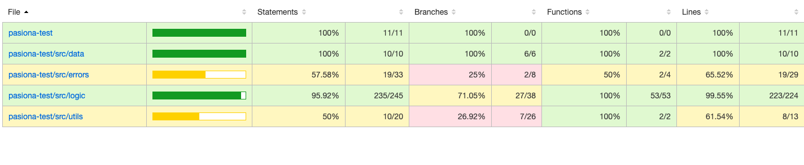

# pasiona-test

## Description
-------------
This is a RESTful api that manages some information regarding insurance policies and company clients
There are two services that provide all of the data needed:

- The list of company clients can be found at: http://www.mocky.io/v2/5808862710000087232b75ac
- The list of company policies can be found at: http://www.mocky.io/v2/580891a4100000e8242b75c5

I have created the following endpoints:

- Get user data filtered by user id -> Can be accessed by users with role "users" and "admin"
- Get user data filtered by user name -> Can be accessed by users with role "users" and "admin"
- Get the list of policies linked to a user name -> Can be accessed by users with role "admin"
- Get the user linked to a policy number -> Can be accessed by users with role "admin"

There is authification using jsonwebtoken where only the email is needed, as there is no data regarding
the password.

Tests have been done using Mocha Chai.

### **Running the application**

1. Open the folder pasiona-test in the console
2. Install npm modules
2. Start the application

```
$ npm i
```

```
$ node server.js
```

nodemon can also be used for development purposes

```
$ npm run nodemon
```

### Running tests
---

1. In the console:

```
$ npm run test
```




## Technical Description

The Api was done using Node.js and the Express framework. JSON web tokens were used for authentification.
Custom middlewares were used in order to handle access to the endpoints for certain roles.
Morgan and winston were used for logging, that logs everytime a user makes an api call to an endpoint and when 
a the user is started and abruptly shut down.


